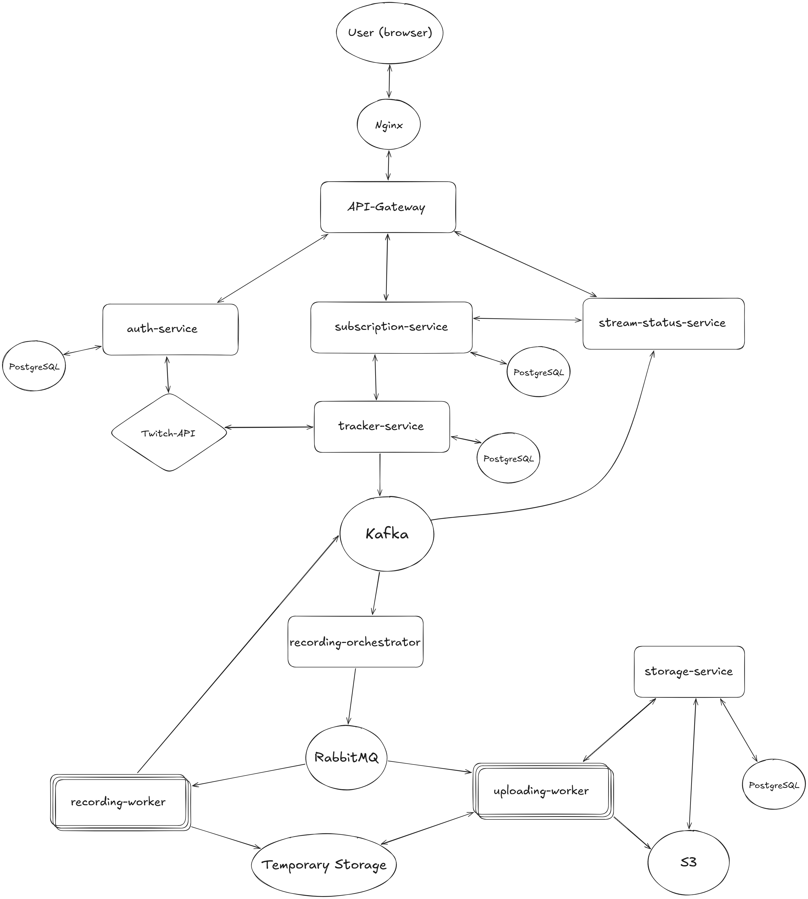

# Overview
Stream-Archivist is a service for recording Twitch streams.
You provide a streamer’s nickname, and the system automatically monitors the stream and records it whenever the streamer goes live.
No manual actions are required after the streamer is added.

# Architecture
The system is built as a set of loosely coupled services connected through HTTP APIs and message queues.

User-facing actions go through an API Gateway, which routes requests to dedicated backend services.
Stream lifecycle events are propagated asynchronously through Kafka and RabbitMQ, enabling both
background processing (recording, uploading) and real-time stream status delivery to clients.




**Main components:**

- **Frontend** initiates user actions such as authentication and streamer subscription.

- **API Gateway** routes incoming requests to backend services.

- **auth-service** handles user registration and authentication.

- **subscription-service** acts as the entry point for streamer subscriptions and orchestrates streamer tracking by delegating to tracker-service.

- **stream-status-service** aggregates stream lifecycle events and exposes real-time stream status updates to clients via Server-Sent Events (SSE).

- **tracker-service** stores streamer information, manages Twitch webhook subscriptions, and detects stream start/end events from Twitch.

- **recording-orchestrator-service** consumes stream start events from Kafka and coordinates recording workers via RabbitMQ.

- **recording-worker** records live streams to local disk and emits a completion event after the stream ends.

- **uploading-worker** uploads recorded files from local disk to S3 using pre-signed URLs.

- **storage-service** issues pre-signed upload URLs and finalizes multipart uploads in S3.

- **temporary storage** is used only as a buffering layer before uploading to object storage.


# How to run

The project can be started locally using Docker Compose:

```bash
docker compose up --build -d
```

This command starts all services and is sufficient to verify that the system boots correctly.
Some functionality (such as real Twitch stream tracking and recording) requires additional setup:
- Twitch API credentials
- a publicly accessible webhook endpoint for Twitch events

These are not required for a basic local startup and are intentionally omitted from the minimal setup.