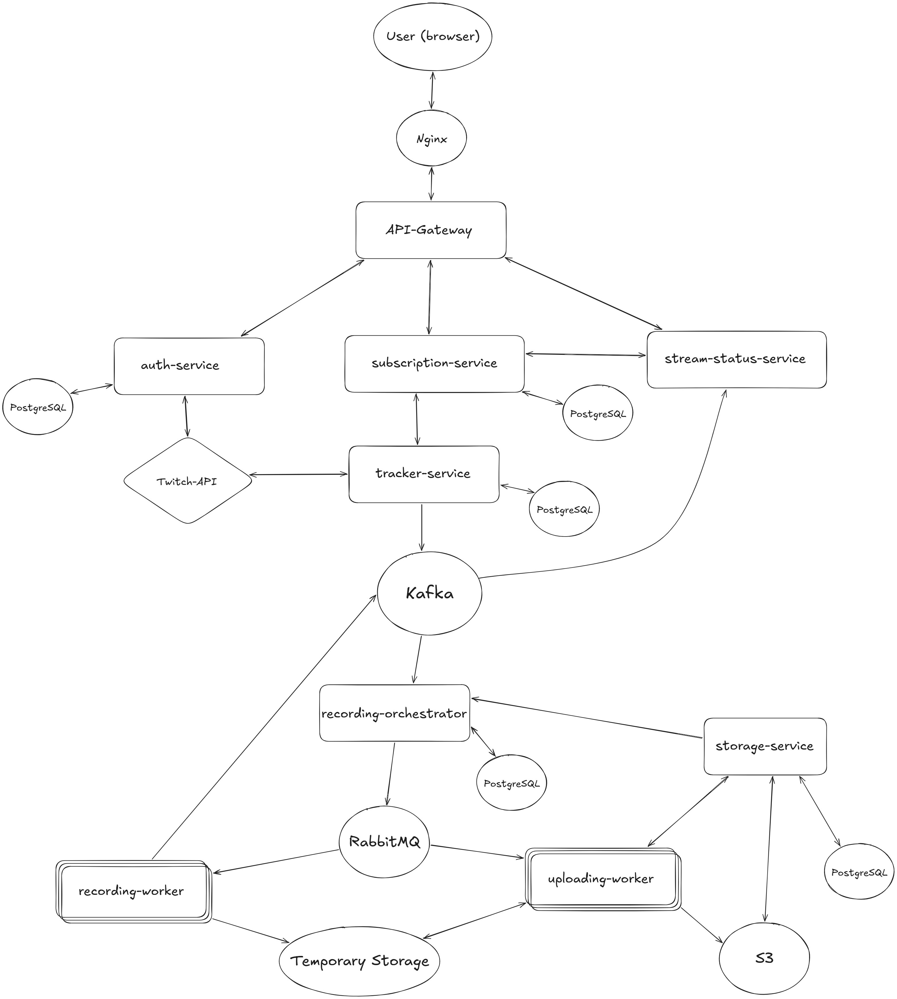

# Overview
Stream-Archivist is a service for recording Twitch streams.
You provide a streamer’s nickname, and the system automatically monitors the stream and records it whenever the streamer goes live.
No manual actions are required after the streamer is added.

# Architecture
The system is built as a set of loosely coupled services connected through HTTP APIs and message queues.

User requests first reach a Nginx reverse proxy, which serves the Angular frontend and routes API
requests to the API Gateway. The gateway then forwards requests to dedicated backend services.
Stream lifecycle events are propagated asynchronously through Kafka and RabbitMQ, enabling both
background processing (recording, uploading) and real-time stream status delivery to clients.




**Main components:**

- **Frontend (Angular)** provides the user interface and runs in the user's browser.

- **Nginx** serves the frontend static files and routes API requests to the API Gateway.

- **API Gateway** routes incoming requests to backend services.

- **auth-service** handles user registration and authentication.

- **subscription-service** acts as the entry point for streamer subscriptions and orchestrates streamer tracking by delegating to tracker-service.

- **stream-status-service** aggregates stream lifecycle events and exposes real-time stream status updates to clients via Server-Sent Events (SSE).

- **tracker-service** stores streamer information, manages Twitch webhook subscriptions, and detects stream start/end events from Twitch.

- **recording-orchestrator-service** consumes stream start events from Kafka and coordinates recording workers via RabbitMQ.

- **recording-worker** records live streams to local disk and emits a completion event after the stream ends.

- **uploading-worker** uploads recorded files from local disk to S3 using pre-signed URLs.

- **storage-service** issues pre-signed upload URLs and finalizes multipart uploads in S3.

- **temporary storage** is used only as a buffering layer before uploading to object storage.


# How to Run

## Prerequisites
This project relies on Twitch integration for core functionality.

Before running the system, you need to obtain:
* `TWITCH_CLIENT_ID`
* `TWITCH_CLIENT_SECRET`
* a publicly accessible URL for Twitch webhooks (e.g., via ngrok)

Without these, the system will start but will not be usable.

## 1. Clone the repository

```bash
git clone https://github.com/aslmk/stream-archivist
cd stream-archivist
```

## 2. Configure environment variables

```bash
cp .env.example .env
```

Fill in all required values, especially Twitch credentials.

## 3. Run the system

```bash
docker compose up --build -d
```